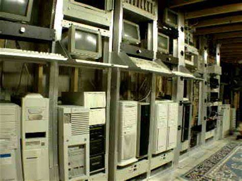
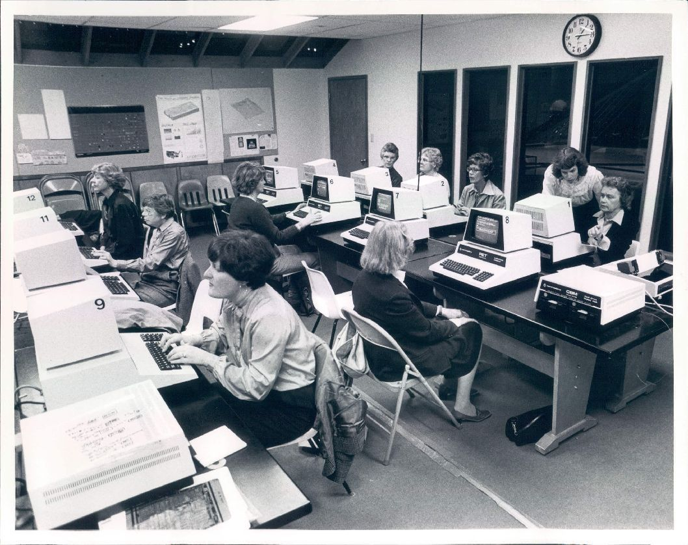
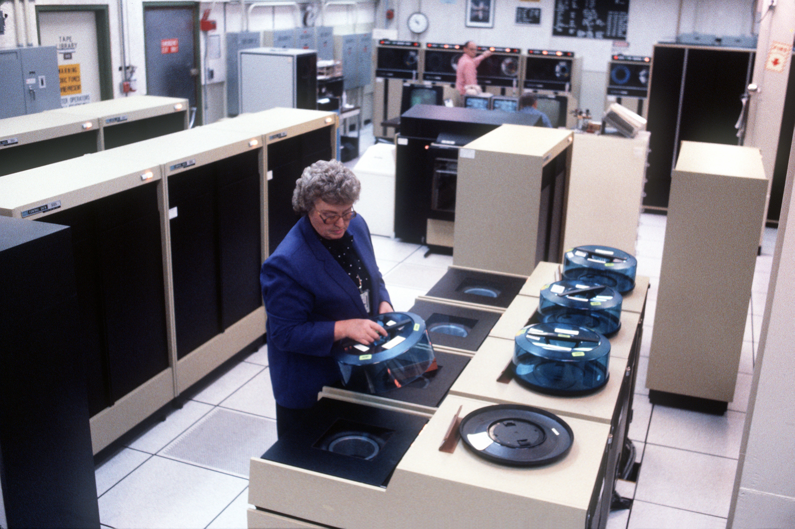
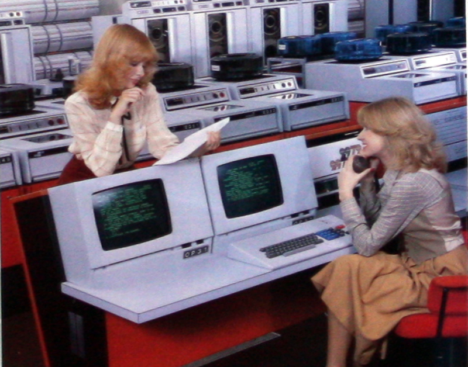

# Talk: Working with Docker containers for python applications, what, why and how (30 min Talk + 10 min questions)

Docker containers are the modern way of building and sharing executable packages.

In this talk we go over a brief history of app visualization and the why people use docker containers in their modern day workflows.

Practical examples of using docker with python will be shown:
- Building a docker file for a simple python program
- Setting up a more complex system by packaging a Django application in docker compose

This talk should leave you with an understanding of what docker is, how it is used and useful examples of how to use in with a python project.

This talk was given for the code & coffee + python girls communites on 2020-11-09, with the video recording saved in [talk-video](https://gitlab.com/codecoffee/docker-talk/-/tree/master/talk-video)

## Rough history of running code on machines

Early days (1970s - 1990s), everything ran on the same mainframe/server. Generally what ever worked.






A few things changes:
* Malware came into existance E.g. Moris worm Nov 2, 1988, infected 10% of computers attached to the internet
* More software languages & frameworks came into existence
* Lots of legacy apps running on different vendor hardware
* Servers became more powerful


## Attempts at isolating running processes

Early attempts involved locking programs down into specific directories and limiting where they where able to execute.

PHP (1994) with Apache web server (1995), worked in this manner and created 'virtual hosts', for running multiple php applications on the same machine.

Complicated to setup, lots of security issues with applications escaping their directory, restricted to only one version of php

## Virtualization

Originally developed in the 1960s, but not widely adopted until the early 2000s.
Virtualization, simulates a virtual machine - it allows you to run multiple operating systems on the same machine inside a virtual environment.


Solves a couple of major problems:
* Isolate applications entirely
* Run legacy apps on multiple operating systems at the same time, on a single machine

Downside, is a performance overhead:

* You have to separate physical resources from the virtual environments, using a hypervisor
* You need to run an operating system for each application

```
VM layer overhead, Linux guest:

CPU and Memory: ~15%

Network I/O: ~25%

Disk I/O: ~9%

Disk latency for reading: ~2 times slower

Micro-operations execution time: ~10 times slower
```

Virtualisation is still useful and commonly used today:
- Digital Ocean Droplets (cloud)
- Google Virtual Machine instances (cloud)
- Amazon EC2 and Lightsail (cloud)
- Microsoft Azure Virtual Machine (cloud)
- VirtualBox/Vagrant (PC)


## Docker - an iteration and improvement

Docker (2013+) uses the tools that come with linux to isolate applications in a more efficient way.

It comes with two great features:
- Operating system level containerisation
- Layered filesystem building (OverlayFS)

### Operating system level containerisation
Docker is a container system, i.e applications runs on the same linux kernel, rather than in separate virtual operating systems.
This is done through clever use of features in the linux kernel called control groups (cgroups) that can limit, control and isolate resources (CPU, memory, disk I/O, network, etc.) used by a set of processes.

Because you don't have to run an entire operating system for each application, and simulate a machine using a hypervisor, there is very low performance overhead.

It also allows applications built inside docker containers to be triggered and run quickly

``` bash
$ docker run --rm my-image
```

While a virtual machine would require
```
virtual machine up
virtual machine run my-process
virtual machine down
```

This is the magic behind aws lambda functions (and similar).

### Layered filesystem building (OverlayFS)
The layered filesystem, allows build steps to be cached. E.g Say you have a build process which is

```
1) RUN apt get install python-pip -y
2) COPY requirements.txt .
3) RUN pip install -r requirements.txt
4) COPY my_build_process.py .
5) RUN python my_build_process.py
```

With a traditional build system, all commands 1-5, would need to be run, each time a code change to my_build_process.py is made.

With docker, once the build is done once, previous layers are cached and re-used if not changed. I.e. if I only change my_build_process.py, then only steps 4-5 need to be re-run. This saves A LOT of time!

### Image storage, container shipping

As you don't need to store an entire os inside a docker container, the images can be made very small (Alphine linux 5MB, python slim 115MB).
This has lead to a while host of automating deployment, scaling, and management of containerized applications (Kubernates, teraform, openshift, dockerswarm).
As the docker containers can be made small, light and fast, technologies for spinning up applications on demand across multiple sites have become possible.

# Practical examples
Three practical examples are provided to get you going.

A simple python application wrapped in a docker container [README.md](01-docker-python/README.md)

A simple flash serice wrapped in a docker container and docker compose [README.md](02-docker-python-daemon/README.md)

A django application process held together using docker-compose [README.md](03-docker-django/README.md)
